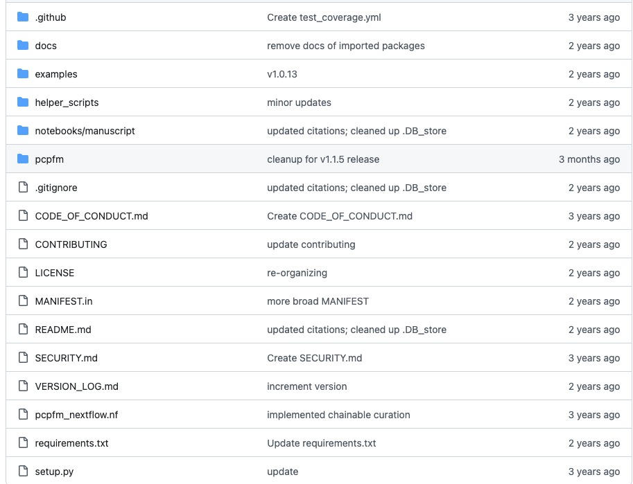

# CodeReview
This repository is part of the requirement for BIOL7180-EA1 at Auburn University as part of fulfilling the requirement for GCERT Computational Biology.


# Publication for Review
I am currently working on a metabolonmics studies on dinoflagellate specifically Pyrocystis **formis** and Pyrocystis **lunula**. This will be a great opportunity to work on a scripts that analyse such data.

## Title of publication

**Common data models to streamline metabolomics processing and annotation, and implementation in a Python pipeline**

+ [DOi](https://doi.org/10.1371/journal.pcbi.1011912)

+ [Github Page](https://github.com/shuzhao-li-lab/PythonCentricPipelineForMetabolomics)

## Publication

The article for review can be found **[here]**(https://journals.plos.org/ploscompbiol/article?id=10.1371/journal.pcbi.1011912)


# REVIEW
The information below constitutes the review of the [above publication](#publication) [titled](#title-of-publication). It's important to point out that, the review will center on the codes and materials on the [github page](#title-of-publication). The main goal is to assess whether the developer followed good  coding / progamming practices. The will also afford me the opportunity to learn more about some of the subtle details which are essential to ensuring reproducibility and readability of programs. The table of content below will help with easy navigation of this readme file.

## **Table of Content**
- [Directory organization](#directory-organization)
- [Access and intallation of program](#access-and-intallation-of-program)
- [File organization and extention](#file-organization-and-extention)
- [Adherence to good programming practices](#adherence-to-good-programming-practices)
- [Area of improvement ](#area-of-improvement)
- [Comment on overall reproducibility of code](#comment-on-overall-reproducibility-of-code)
- [Concluding remarks](#concluding-remarks)

## Directory organization
Directory organization eases a users ability to find the script for file. The program was well organized into various directories to allow easy access to file and director. Another good observation was that, the developer followed all the good coding practices for naming directories. All directories are essentially named with **lowercases** and where neccesary underscores were used. Find a snapshot of the directory organization below.



## Access, intallation, and Documentation
The **README** provides a comprehensive documentation about what the program is about. It states clearly what input files (eg. .raw, .mzML) files are supported. It also provides a quick summary of what goes on under the hood and explicitly mention what the output file look like (eg. .txt, .JSON). The type of normalization and batch correction used in the analysis are explicitly mentioned in the readme file as well as the type of databases (eg. HMDB, LIPID MAP) and libraries supported.

The author provides a pictorial/ graphical workflow summarizing the sequence of event in the analyzes process. The directory structure is clearly indicated.

The author also provides clear instructions how to install the tool using **pip** and also manually

```
pip insall pcpfm
```

```
pip install -e .
```  

or 


```
pip install .

```

The author also provides the most basic usage syntax of the tool. This I think is very essential to help those user who are not familiar with the tool.

```pcpfm preprocess -s ./Sequence.csv --new_csv_path ./NewSequence.csv --name_field='Name' --path_field='Path' --preprocessing_config ./pcpfm/prerpocessing.json```

Some of the challenges user face when using tools like this, is how to organize the input data in a way that's compatible with the user. The developer does well by providing an example csv file format for imput file.

| Sample Type | Name             | Filepath                           |
|-------------|-----------------|-----------------------------------|
| Blank       | SZ_01282024_01  | my_experiment/SZ_01282024_01.raw |
| QC          | SZ_01282024_07  | my_experiment/SZ_01282024_07.raw |
| Unknown     | SZ_01282024_13  | my_experiment/SZ_01282024_13.raw |
| ...         | ...             | ...                               |


Overall, the developer provides a comprehensive instructions and documention on how to install, use, and fix common errors that arrives through improper input file formats etc.
This documentation provides an easy to understand instruction which makes it easy to start using the file right away.

However, what I didn't see in the documention was how installation works on different environments and operationg system. Since this tool is not using a `docker image` or `containerization` for packaging the tool. I was expecting to see how installation works on other environments such as `windows`, `clusters`, etc.

## File organization and extention

## Adherence to good programming practices
The assessment of good programming practices were done on the main program. The python program in the [pcpfm directory](https://github.com/shuzhao-li-lab/PythonCentricPipelineForMetabolomics/tree/main/pcpfm) were carefully assessed for good coding practices.

The python program were carefully grouped in classes and modulized. The writing of the program into modules was excellent.

### Functions and Variables
The program has been written in to `function`. Each function does just one thing and `return` a value.
#### Doctrings
All the functions have `doctrings`. The doctrings have been clearly written with description of the function, argument, and return values.
#### Naming of variables and function
The functions and variables are clearly being named. The names of variables and functions are descriptive and aligns with what the function does. All the `pythonic` conventions for naming variables and functions followed.

```
- Acquisition.py
- EmpCpds.py
- Experiment.py
- FeatureTable.py
- MSnSpectrum.py
- Report.py
- Report2.py
- __init__.py
- __main__.py
- default_parameters.py
- main.py
- utils.py
```

All the python modules were carefully assesed and the programs were carefully written obeying good programming practices.

Again, the program in the `helper_scripts()` directory.

```
- block_designer.py
- randomizer.py
```
The code in the programs above didn't have `docstrings`.

## Area of improvement
The program, though, have `docstrings` do not have `#` comments. This makes reading of the program quit difficult if you do not have background in metabolomics.

## Comment on overall reproducibility of code
The code is overall greatly reproducible and easy to understand.

## Concluding remarks
Apart from the `codes` not having comments. The documentation are apt and easy to follow.